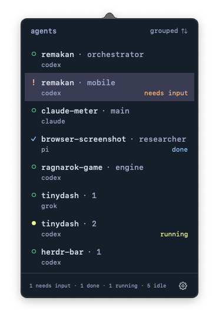

# Herdr Bar

A native macOS menu bar app for [Herdr](https://herdr.dev). See which agents are running, need input, or have finished. Click an agent to open its pane in your terminal.



The app subscribes to Herdr events, so it shows each status change immediately. If events are not available, the app checks every two seconds. Use Settings to enable notifications, start at login, or choose your terminal. With the Automatic setting, the app opens the terminal that runs your Herdr session.

## Build and run

Requires macOS 14 or later, Swift 6 build tools, and a running local Herdr session.

```sh
./scripts/build.sh --open
```

The script creates `dist/Herdr Bar.app`. Move it to `~/Applications` for regular use. Quit the running app before you launch a new build.

## Development

```sh
swift test
swift run HerdrBar --check
```

Built with SwiftUI and AppKit. No external packages.

## Release

Set the version in `Resources/Info.plist` and commit it. Then run:

```sh
./scripts/release.sh
```

The script runs the tests, builds the app, signs it with a Developer ID, notarizes it, and staples the ticket. It creates `dist/HerdrBar-VERSION.zip` and prints its SHA-256. It does not publish anything. The script needs a Developer ID Application identity and notary credentials in the Keychain (`xcrun notarytool store-credentials notarytool`).

Publish the zip with `gh release create vVERSION dist/HerdrBar-VERSION.zip`.
