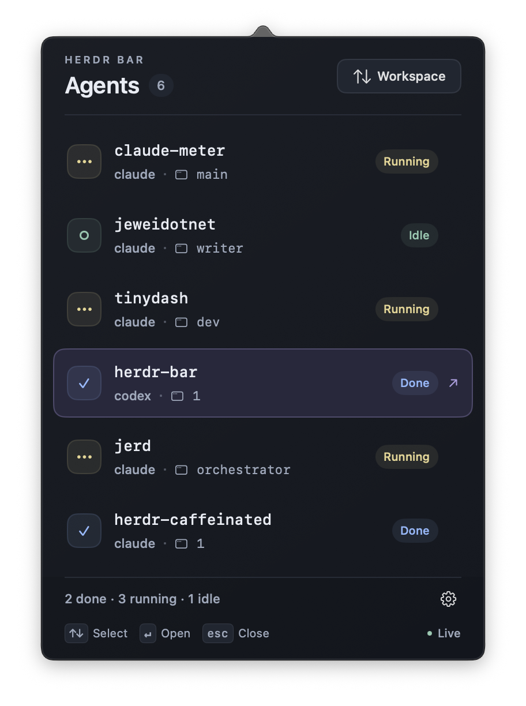

# Herdr Bar

Herdr Bar is a native macOS menu bar app for [Herdr](https://herdr.dev).
It shows which agents are active, need input, or have finished.
An agent row opens the agent's pane in your terminal.



## Requirements

The app requires macOS 14 or later and a local Herdr session.
Builds require Swift 6 tools. Herdr Bar uses SwiftUI and AppKit, with no external
packages.

The [build and test guide](docs/development.md) covers the build command:

```sh
./scripts/build.sh --open
```

The script creates `dist/Herdr Bar.app` for the host CPU architecture.

## Status and notifications

Herdr Bar subscribes to Herdr events. The app can show running activity as soon
as an event arrives. Attention states and notifications require snapshot
validation. Without an event stream, the app requests a snapshot every two
seconds.

The palette shows **Live** or **Polling**. The label's help text shows the last
successful refresh and any event stream error. **Settings** contains notification,
login, terminal, and connection controls.

**Done** means that Herdr Bar has an unread completion. Other Herdr clients
cannot clear this local state. A successful open or **Mark completed agents as
read** clears the completion. Opening a blocked agent leaves its blocked state
unchanged. App restarts and connection changes clear local unread state.
The [completion policy](docs/architecture.md#completion-policy) describes other
state changes that clear a completion and the limits of event recovery.

With **Automatic** terminal selection, the app activates the terminal application
that hosts the Herdr session. Selection of a specific outer terminal window or
tab is not guaranteed.

## Connection

The app selects the socket path in this order:

1. A nonempty **Connection** setting saved in Herdr Bar. The app expands a leading
   `~` when it saves this setting.
2. A nonempty `HERDR_SOCKET_PATH` in the app's environment.
3. A path relative to the directory that contains `HERDR_CONFIG_PATH`.
   If that variable is empty or absent, the directory is `~/.config/herdr`.
   A nonempty `HERDR_SESSION` selects `sessions/SESSION/herdr.sock` within that
   directory. Otherwise, the app uses `herdr.sock` in that directory.

Apps opened from Finder or at login normally do not receive shell environment
variables. The [troubleshooting guide](docs/troubleshooting.md) covers socket
settings, connection failures, terminal selection, and notifications.

## Development and release

CI selects Xcode 16.4 on macOS 15. It checks text format and shell syntax,
runs debug and release tests, and tests release scripts with mock Apple services.
CI also builds and validates an app bundle. macOS 14 is the deployment target.
CI does not test every supported OS version.

The documentation covers these tasks and behaviors:

| Document | Contents |
| --- | --- |
| [Build and test](docs/development.md) | Local builds, tests, previews, and text format checks |
| [Create and publish a release](docs/release.md) | Version rules, signing, notarization, and release files |
| [Check a release on macOS](docs/native-checklist.md) | Interactive checks for the app and distribution archive |
| [Native verification](docs/native-verification.md) | Recorded results and release 1.0.1 exclusions |
| [State and task ownership](docs/architecture.md) | Agent identity, completion state, events, and cancellation |
| [Protocol compatibility](docs/protocol-compatibility.md) | Herdr 0.9.1 fixtures, response types, and client limits |
| [Measure performance](docs/performance.md) | Workloads, process counters, and discovery timings |
| [Performance baseline](docs/performance-baseline.md) | Recorded CPU, wakeup, and memory measurements |
| [First review decisions](docs/review-decisions.md) | Initial fixes and deferred changes |
| [Second review decisions](docs/second-review-decisions.md) | Event validation and response type fixes |
